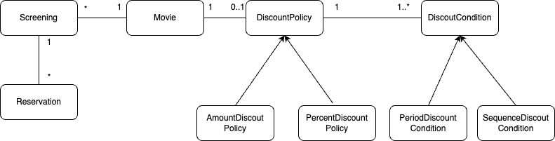

# 영화 예매 시스템

## 요구사항 분석
영화상영을 예매하려는 예매자를 위한 시스템으로 예매자는 예매시에 할인을 받을 수 있으며 할인 조건은 크게 두 가지로 나뉜다
### 할인 조건
- 순서조건
  - 상영순번을 통해 할인혜택을 부여한다
  - 예를 들어 순서조건이 10인 경우 매일 10번째 영화를 예매하는 사용자들에게 할인혜택을 제공한다
- 기간조건
  - 영화 상영시작 시간을 기준으로 할인혜택을 부여한다
  - 기간조건은 요일, 시작시간, 종료시간 세 부분으로 구성된다
  - 영화 시작시간이 해당 기간에 포함될 경우 할인혜택을 제공한다
  - 예를 들어 시작시간이 오전10시, 종료시간이 오후1시인 기간 조건을 사용하면 매주 월요일 오전10시부터 오후1시 사이에 상영되는 모든 영화에 대한 할인혜택을 적용한다

### 할인 정책
할인 정책은 할인 요금을 직접적으로 결정한다
- 금액할인정책
  - 예매 요금에서 정해진 일정 금액을 할인해주는 방식이다
- 비율할인정책
  - 예매 요금에서 일정 비율의 요금을 할인해주는 방식이다

**영화별로 하나의 할인 정책만 할당할 수 있으며 할인정책을 지정하지 않을 수도 있다**
**할인조건은 다수의 할인 조건을 함께 지정할 수 있으며 순서조건과 기간조건을 섞는 것도 가능하다**

## 클래스 구조

## 기능 명세
**상태를 생각하지말고 객체간의 협력을 생각하고, 협력을 위해서 어떤 기능이 필요한지를 먼저 생각할것**

- 원하는 영화를 예매한다
- 영화의 할인 정책을 등록한다
- 영화의 할인 조건을 등록한다
- 영화의 이름, 상영시간, 가격정보를 등록한다

### Movie
### Reservation
### Screening
### DiscountPolicy
### DiscountCondition